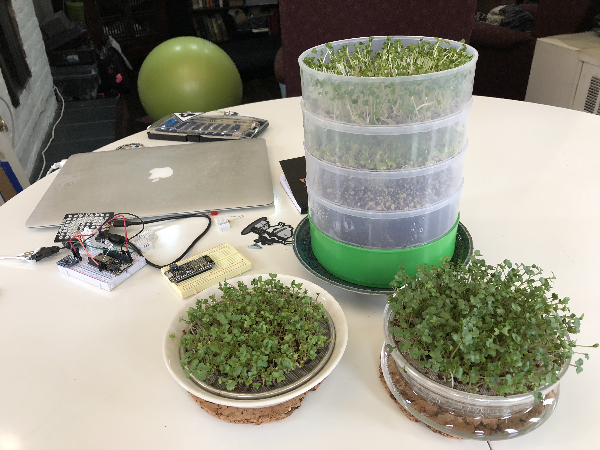
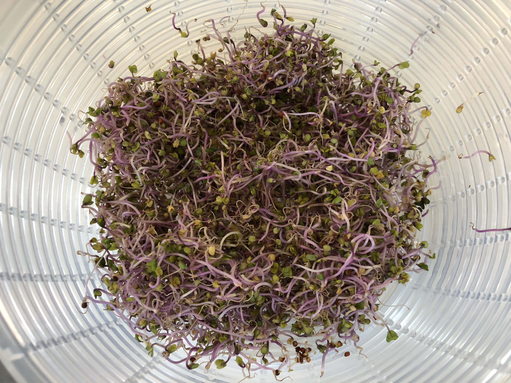

# A Guide to Low-Commitment Gardening: Sprouts and Microgreens

## Table of Contents

* [Containers for Sprouting](#containers-for-sprouting)
	* [EasySprout](#easysprout)
	* [SproutMaster](#sproutmaster)
	* [Botanical Interests Sprouter](#botanical-interests-sprouter)
	* [Vittorio Tiered Sprouter](#vittorio-tiered-sprouter)
	* [Glass Jar](#glass-jar)

* [Containers for Microgreens](#containers-for-microgreens)
	* [Plastic Trays](#plastic-trays)
	* [Wire Inserts](#wire-inserts)
	* [Lettuce Boxes](#lettuce-boxes)
* [Medium and Supplements](#medium-and-supplements)
	* [Baby's Blanket](#baby's-blanket)
	* [Coconut Coir](#coconut-coir)
	* [Kelp Fertilizer](#kelp-fertilizer)
	* [Earthworm Castings](#earthworm-castings)

* [Plants](#plants)
	* [Arugula](#arugula)
	* [Broccoli](#broccoli)
	* [Cilantro](#cilantro)
	* [Dill](#dill)
	* [Fenugreek](#fenugreek)
	* [Kohlrabi](#kohlrabi)
	* [Brassica based mixes](#brassica-based-mixes)
	* [Red Clover based mixes](#red-clover-based-mixes)
	* [Mung Beans](#mung-beans)
	* [Mustard](#mustard)
	* [Radish](#radish)
	* [Tuinkers aka Garden Cress)](#tuinkers-aka-garden-cress)

## Containers for Sprouting

### EasySprout

This is by far the most convenient sprouter I've tried.  It produces a huge amount of sprouts at once and it's easy to remove the hulls by stirring the sprouts and pouring off the hulls that float to the top.

However, sprouts grown in the EasySprout tend to be thin and pale in comparison to those grown on a tray-like sprouter like the [Sprout Master](#sprout-master) or the [Botanical Interests sprouter](#botanical-interests-sprouter).

One solution to the paleness problem is to remove the sprouts on the last day and spread them out to dry in the sun.

#### What Grows Well:

* [Red Clover based mixes](#red-clover-based-mixes)

#### What Grows Poorly:

* [Kohlrabi](#kohlrabi) There was low yield and poor growth, although I had sanitized the seeds, so that's a confounding factor.

#### Amounts:

* Broccoli and brassica based mixes: 2 tablespoons
* Red clover based mixes: 2 tablespoons, 5-6 days

### Sprout Master

A very convenient sprouter, with the one drawback being that it's hard to de-hull sprouts grown in the Sprout Master because the hulls will tend to adhere to the root area of the sprouts, unlike in the EasySprout where rinsing actually loosens and frees the hulls.

Sprouts will grow straight up in the sprouter, so you'll get longer, thicker stems and if you put them in the sun you'll get darker green leaves.

#### What Grows Well:

* [Mung beans](#mung-beans) 
* [Broccoli](#broccoli)
* [Brassica based mixes](#brassica-based-mixes)
* [Red Clover based mixes](#red-clover-based-mixes)

#### What Grows Poorly:

#### Amounts:

(Per half of 5-6 inch tray)

* Broccoli and brassica based mixes: 2 teaspoons, 6-7 days
* Red clover based mixes: 2 teaspoons, 6-7 days
* Mung beans: 1/4 cup (better to do the whole tray, so 1/2 cup)

### Botanical Interests Sprouter

It's very similar to the [Sprout Master](#sprout-master), but it's more attractive (well, I guess that's a matter of taste).  Since the walls are clear you can more easily monitor how things are going. Like the Sprout Master, it's hard to de-hull sprouts grown in this one because the hulls will adhere to the root area.

### Vittorio Tiered Sprouter

tl;dr meh

If you're going for a large volume of thick, green sprouts, then this sprouter is a good choice.  The problem is that the temptation is to pipeline them, placing the newest seeds at the bottom, and the more mature sprouts on top.  If you do this and a tray at the top starts to develop mold, you'll spread it down through all of the other trays and contaminate everything.  And since this sprouter tends to retain a bit too much water due to it's limited number of drainage holes, mold is a real danger.  After having this happen to me I stopped using this sprouter -- there are better options.

The sprouts in the Vittorio sprouter in this image would ultimately fail.  The whole lot of them.

You'll be fine if you sanitize the sprouter well between uses and start seeds in all the tiers at the same time.  When it comes time to green up the leaves you'll need to disassemble the tower and spread the trays out in the sun, so the footprint of the system will get considerable larger.  And you'll be harvesting a whole lot of sprouts all at once.

I tried using the tiers to grow microgreens by placing baby's blanket in them, but everything but arugula failed.

### Glass Jar

Just don't.  

They're unweildy, they leak, they roll around, they can break, if there is any metal involved with the lid it rusts.  There are so many better options.

## Containers for Microgreens

### Plastic Trays
### Wire Inserts

There are several types of growers that are essentially a tray with a wire insert that you put the seeds on top of.  I have a couple of nice glass ones from Dille & Kamille.  They're the most attractive way to grow microgreens, but not the most convenient.  To harvest you'll want to trim them off the wire insert, and then have fun getting the thing clean.  Pull all the stems off the top first, then the roots off the bottom, then scrub under running water with soap.

Each day you should pull the insert out and replace the water in the tray, and I usually give the sprouts a rinse at this time, as well.  You'll also want to have something to cover the tray for the first couple of days as the seeds can easily dry out -- unless you have the wire grate submerged in the water, in which case you risk having your seeds float all to one side or end up in the resevoir.

But they are gorgeous!  So, if you want something attractive and you're willing ot work for it, this is your best option.

### Lettuce Boxes

## Medium and Supplements

### Baby's Blanket
### Coconut Coir
### Kelp Fertilizer
### Earthworm Castings

## Plants

### Arugula

#### As a Microgreen

Arugula grew fine on baby's blanket in one of the Vittorio tiers.

### Broccoli
### Cilantro
### Dill
### Fenugreek
### Kohlrabi

#### As a Sprout

They don't seem to grow well in the EasySprout -- but I had sanitized the seeds, so I don't know if that affected them.  They had a poor yield, with plenty of ungerminated seeds, and the sprouts themselves were thin (which is expected in this sprouter).  Took about 7 days.

#### As a Microgreen

Kohlrabi makes a beautiful microgreen, with lush growth and tall purple stems with green leaves.  This was grown on baby's blanket in a black tray, 11 days.

### Brassica based mixes
### Red Clover based mixes
### Mung Beans

Mung beans will develop thicker stems (roots?) if you place a weight on them.  No, seriously.  I've used a ziploc bag filled with water, and that worked pretty well.

In the Sprout Master use 1/2 cup seeds for one entire tray.  

### Mustard ### Radish ### Tuinkers aka Garden Cress

Tuinkers are one of my favorites.
