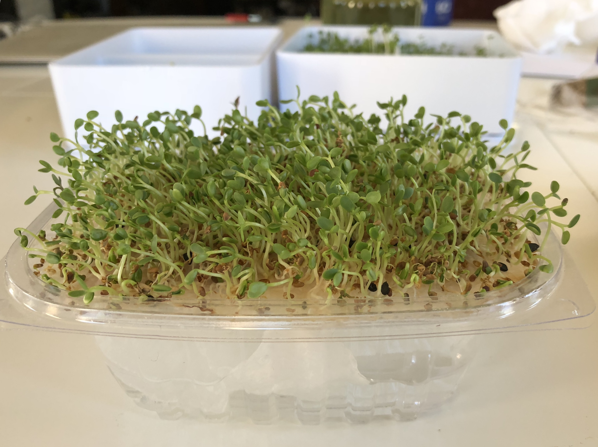

# A Guide to Low-Commitment Gardening: Sprouts and Microgreens

## Table of Contents

* [Containers for Sprouting](#containers-for-sprouting)
	* [EasySprout](#easysprout)
	* [SproutMaster](#sproutmaster)
	* [Botanical Interests Sprouter](#botanical-interests-sprouter)
	* [Vittorio Tiered Sprouter](#vittorio-tiered-sprouter)
	* [Glass Jar](#glass-jar)

* [Containers for Microgreens](#containers-for-microgreens)
	* [Plastic Trays](#plastic-trays)
	* [Wire Inserts](#wire-inserts)
	* [Lettuce Boxes](#lettuce-boxes)

* [Media](#media)
	* [Baby's Blanket](#baby's-blanket)
	* [Coconut Coir](#coconut-coir)
	* [Clay Pebbles](#clay-pebbles)
	* [Gravel](#gravel)

* [Nutrient Solutions](#nutrient-solutions)
	* [Kelp Fertilizer](#kelp-fertilizer)
	* [Earthworm Castings](#earthworm-castings)
	* [Hydroponic Solutions](#hydroponic-solutions)

* [Pests](#pests)

* [Environment](#environment)

* [Hydroponic Techniques](#hydroponic-techniques)

* [Automated Systems](#automated-systems)

* [Plants](#plants)
	* [Arugula](#arugula)
	* [Broccoli](#broccoli)
	* [Cilantro](#cilantro)
	* [Dill](#dill)
	* [Fenugreek](#fenugreek)
	* [Kohlrabi](#kohlrabi)
	* [Brassica based mixes](#brassica-based-mixes)
	* [Red Clover based mixes](#red-clover-based-mixes)
	* [Mung Beans](#mung-beans)
	* [Mustard](#mustard)
	* [Radish](#radish)
	* [Tuinkers aka Garden Cress)](#tuinkers-aka-garden-cress)

## Containers for Sprouting

### EasySprout

This is by far the most convenient sprouter I've tried.  It produces a huge amount of sprouts at once and it's easy to remove the hulls by stirring the sprouts and pouring off the hulls that float to the top.

However, sprouts grown in the EasySprout tend to be thin and pale in comparison to those grown on a tray-like sprouter like the [Sprout Master](#sprout-master) or the [Botanical Interests sprouter](#botanical-interests-sprouter).

One solution to the paleness problem is to remove the sprouts on the last day and spread them out to dry in the sun.

#### What Grows Well:

* [Red Clover based mixes](#red-clover-based-mixes)

#### What Grows Poorly:

* [Kohlrabi](#kohlrabi) There was low yield and poor growth, although I had sanitized the seeds, so that's a confounding factor.

#### Amounts:

* Broccoli and brassica based mixes: 2 tablespoons
* Red clover based mixes: 2 tablespoons, 5-6 days

### Sprout Master

A very convenient sprouter, with the one drawback being that it's hard to de-hull sprouts grown in the Sprout Master because the hulls will tend to adhere to the root area of the sprouts, unlike in the EasySprout where rinsing actually loosens and frees the hulls.

Sprouts will grow straight up in the sprouter, so you'll get longer, thicker stems and if you put them in the sun you'll get darker green leaves.

#### What Grows Well:

* [Mung beans](#mung-beans) 
* [Broccoli](#broccoli)
* [Brassica based mixes](#brassica-based-mixes)
* [Red Clover based mixes](#red-clover-based-mixes)

#### What Grows Poorly:

#### Amounts:

(Per half of 5-6 inch tray)

* Broccoli and brassica based mixes: 2 teaspoons, 6-7 days
* Red clover based mixes: 2 teaspoons, 6-7 days
* Mung beans: 1/4 cup (better to do the whole tray, so 1/2 cup)

### Botanical Interests Sprouter

It's very similar to the [Sprout Master](#sprout-master), but it's more attractive (well, I guess that's a matter of taste).  Since the walls are clear you can more easily monitor how things are going. Like the Sprout Master, it's hard to de-hull sprouts grown in this one because the hulls will adhere to the root area.But, if you don't mind the hulls, you can just pluck sprouts right out of this grower and pop them on your salad.

### Vittorio Tiered Sprouter

tl;dr meh

If you're going for a large volume of thick, green sprouts, then this sprouter is a good choice.  The problem is that the temptation is to pipeline them, placing the newest seeds at the bottom, and the more mature sprouts on top.  If you do this and a tray at the top starts to develop mold, you'll spread it down through all of the other trays and contaminate everything.  And since this sprouter tends to retain a bit too much water due to it's limited number of drainage holes, mold is a real danger.  After having this happen to me I stopped using this sprouter -- there are better options.

The sprouts in the Vittorio sprouter in this image would ultimately fail.  The whole lot of them.

You'll be fine if you sanitize the sprouter well between uses and start seeds in all the tiers at the same time.  When it comes time to green up the leaves you'll need to disassemble the tower and spread the trays out in the sun, so the footprint of the system will get considerable larger.  And you'll be harvesting a whole lot of sprouts all at once.

I tried using the tiers to grow microgreens by placing baby's blanket in them, but everything but arugula failed.

### Glass Jar

Just don't.  

They're unweildy, they leak, they roll around, they can break, if there is any metal involved with the lid it rusts.  There are so many better options.

## Containers for Microgreens

### Plastic Trays
### Wire Inserts

There are several types of growers that are essentially a tray with a wire insert that you put the seeds on top of.  I have a couple of nice glass ones from Dille & Kamille.  They're the most attractive way to grow microgreens, but not the most convenient.  To harvest you'll want to trim them off the wire insert, and then have fun getting the thing clean.  Pull all the stems off the top first, then the roots off the bottom, then scrub under running water with soap.

Each day you should pull the insert out and replace the water in the tray, and I usually give the sprouts a rinse at this time, as well.  You'll also want to have something to cover the tray for the first couple of days as the seeds can easily dry out -- unless you have the wire grate submerged in the water, in which case you risk having your seeds float all to one side or end up in the resevoir.

But they are gorgeous!  So, if you want something attractive and you're willing ot work for it, this is your best option.

### Lettuce Boxes

Lettuce boxes work for growing microgreens.  You can grow them on the lid, with the box serving as a water resevoir, and paper towels pushed through the lid to wick the water up to the plants.  There's no effort needed once you've set them up.

I stumbled across this method on youtube by user Mini-Gro: [https://www.youtube.com/channel/UCWwaIXFtKyN8qEw_sMjfIUA](https://www.youtube.com/channel/UCWwaIXFtKyN8qEw_sMjfIUA).  I don't know who they are, they don't provide any links or info, and they only have 3 videos, but the technique is genius.

I played around with the idea a bit, putting a baby's blanket on top of the paper towels to give the plants something more substantial to grow in than just a paper towel.

This didn't work well.  The roots of the sprouts pushed the baby's blanket up and away from the papertowels, causing it to dry out.  You can see the stunted sprouts in the corners.

A better method, but a bit more fiddly, was to place the baby's blanket *under* the paper towel wick.  I then placed another paper towel on top of the whole thing since the baby's blanket had to be smaller than the size of the lid to fit under the paper towel wick.  Pro tip:  Don't try to moisten the baby's blanket before you install it or it will just dampen your paper towels, which will rip as you try to tighten them down over the medium.

After putting the seeds on I just gave them a quick spritz to dampen them, and then I never watered them again afterwards.  I covered them with an extra lid for the first few days while they germinated.

## Media

Plant roots need oxygen or they rot.  The more oxygen, the better the plant grows.

### Baby's Blanket
### Coconut Coir
### Clay Pebbles

Clay pebbles are large enough to not clog filters.

### Gravel

Gravel can affect the pH of the nutrient water.

## Nutrient Solutions

### Kelp Fertilizer
### Earthworm Castings
### Hydroponic Solutions

## Pests

Sanitizing solutions for containers:

* 1 tablespoon bleach per pint of water
* H2O2
* Grapefruit seed extract

For bugs, neem oil and cayenne pepper spray works.

IPM: integrated pest management.

# Envirmonment

To cool a greenhouse: You can't shade without reducing light, so
go with increasing ventilation instead.  If that doesn't work, then
active cooling is needed.  It's not cost-effective to use refrigerated
air, but in dry climates cooling with evaporative cooling or misting
works, and can needed humidity.

If you're in a very hot and very humid place, shading may be
necessary, and can be limited to the 2-4 hours of highest temperatures
to reduce the amount of light lost.  You'll still only get a 2-4
degree F temperature reduction.

Vapor Pressure Deficit: 

Amount of moisture in the air - Amount of moisture the air can hold when saturated 

Optimum VPD:i

* Herbs and leafy greens: 0.65 - 0.9 kPa (kilopascals) 0.85 is optimum
* Tomatoes, cucumbers, peppers:  0.9 - 1.2 kPa (drier)

When humidity along the leaf Is too high it can't release moisture
into that air, which slows its circulation. If it's too dry it just
closes its stomata and Shuts down to protect itself from excessive
moisture loss.

CO2:

Plants take up CO2 when it's light out. If you need
to ventilate during the day and dont want to lose CO 2 enrichment,
enrich in the morning while it's cool before you start ventilating.
CO2 is taken in via the leaf stomata, so it's best to enrich
when temp, humidity, and VPD/airflow conditions are favorable to
open stomata. 700-1,500 ppm is best for most crops. light conditions
should be favoring photosynthesis, or you'll be wasting CO2.

## Hydroponic Techniques

Hydroponics only deals with the root zone (as a term/description of a type of agriculture). 

Four things are needed in a hydroponic system:

* H2O
* O2 for the roots
* nutrients
* root support

For any system that uses electricity, you should get a GFI to protect
the electrical system from water.

### Deep Water Culture

Aka raft or pond culture. Seedlings are transplanted to styrofoam
rafts. Less risk of sudden water temp, pH, EC, etc. change because
the large volume of water acts as a buffer. Simple, resilient to
power failures. It's great for leafy greens, and any other plant
with small root systems. Can easily revise planting density. Popular
in the tropics.

### Nutrient Film Technique

Aka NFT.  Easy to scale, low water use. High growth rate. Uses
shallow channels where a thin flim of nutrient soln continuously
flows. They tend to be made with a lot of equipment, so they're
complex and clogs & leaks become a big problem. Each trough should
be pitched at a 7 degree angle.

A-frame structures are popular, and allow all levels to get light. 

It's harder to deal with algae if you want to grow organically, it
will clog your pipes, and you can't use chemicals to kill it if
you're growing organically. 

### Wick Systems

### Ebb and Flow

Great for getting 02 to roots, but susceptible to power failures,
tends to be expensive. Fast growth if roots spend time exposed to
the air.

### Drip Systems

With buckets are good for vines like tomatoes, cucumbers, etc.
Basically any plant with a long lifecycle and a large root system.

### Aeroponics

Misting the root zone with a nutrient solution. Allows larger root
growth, excellent oxygenation. Even none complex than NFT. But 67%
more growth.

### Vertical Farming

Costly, power hungry, high growth rate, less water used. Labor intensive,
space-efficient. Can use drip from the top to a wicking strip that
runs down to each plant.

### Kratkey Method

Super simple, you need to be able to harvest in 30 days.  Leafy
greens like mint, basil, lettuce all grow well. Good for home, not
commercial.

## Automated Systems

You can automate nutrient delivery with injectors with a solenoid
valve, but there's less complexity in just dumping the solution
into your resevoir if labor isn't an issue.

For aeration: air stone, splashing, ebb i. flow, aeroponics, venturi.
Using a venturi is a particularly powerful and simple way to add
oxygen to water, but it needs to be designed into the plumbing from
the beginning.

## Media

## Plants

### Arugula

Arugula is a mucilaginous seed.

#### As a Microgreen

Arugula grew fine on baby's blanket in one of the Vittorio tiers.

### Broccoli
### Cilantro

Websites say don't soak.  Some guy on youtube who grows them in bulk for restaurants says soak for 6 hours.  Also get "leisure split" seeds (seeds that are split in two).  

After soaking just put them in a jar (maybe in an EasySprout) and let them germinate like sprouts for 3-5 days.  They do need good air flow, though, or they'll get mold.

They need to go under the dirt, you can spray them into the dirt or plant and cover them with dirt.

Cover them for several days so they get long and leggy, and then grow them in a lot of light.  Probably 20 days to harvest.  

### Dill
### Fenugreek
### Kohlrabi

### Lettuce

Likes cools temperatures.  There's an upper limit for what it can tolerate.

#### As a Sprout

They don't seem to grow well in the EasySprout -- but I had sanitized the seeds, so I don't know if that affected them.  They had a poor yield, with plenty of ungerminated seeds, and the sprouts themselves were thin (which is expected in this sprouter).  Took about 7 days.

#### As a Microgreen

Kohlrabi makes a beautiful microgreen, with lush growth and tall purple stems with green leaves.  This was grown on baby's blanket in a black tray, 11 days.

### Brassica based mixes
### Red Clover based mixes
### Mung Beans

Mung beans will develop thicker stems (roots?) if you place a weight on them.  No, seriously.  I've used a ziploc bag filled with water, and that worked pretty well.

In the Sprout Master use 1/2 cup seeds for one entire tray.  

### Mustard 

### Radish 

### Tuinkers aka Garden Cress

Tuinkers are one of my favorites.
